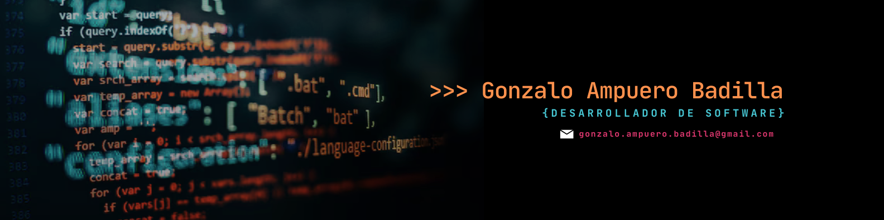

<h1 align="center">Hi there, I'm gonzalo👋</h1>

- 👋 Hi there!
I’m a programming student passionate about learning and creating innovative solutions through code. 🚀

🌟 What I’m Working On
- Building projects to sharpen my skills in Python, Java, and SQL.
- Exploring web development with HTML, CSS, and JavaScript.
- Practicing problem-solving with algorithms and data structures.
  
🎯 Goals for 2025
- Contribute to open-source projects.
- Deepen my understanding of backend development.
- Build a portfolio that reflects my progress and creativity.
  
✨ Fun Facts
- I love experimenting with new technologies.
- Coding challenges and video games keep me motivated. 🎮
- Let’s connect and grow together! 💻🌱

### ⚙️ &nbsp;GitHub Analytics

